# LobeHub 对标页面功能优化实施方案

> 目标：参考 LobeHub 在模型配置、站内通知、数据统计、上下文用量和消息渲染上的产品表达，按 Kila 当前本地优先、unified session、Pi runtime 架构落地。
> 日期：2026-05-30
> 版本：v2（基于代码级评审修订）

## 背景

本方案只讨论页面功能和体验优化，不复制 LobeHub 的云端账号、PostgreSQL、Redis、Zustand 或完整服务端任务体系。Kila 的主线仍然是本地优先、JSON/JSONL 可迁移、单 Session + 单 Agent runtime。

对标点来自：

1. AI 服务商配置页：模型图标、模型 id、发布时间、上下文长度、工具调用、视觉/视频能力、输入/输出价格。
2. 站内通知：比系统脚本通知更统一、可追溯、可点击跳转。
3. 数据统计设置页：更丰富的 token、成本、Provider、Model、Session、压缩收益统计。
4. 对话上下文 token 用量：当前估算不够准确，需要真实 usage + 模型元数据双轨校准。
5. 消息对话体验：流式输出、富文本渲染、代码渲染、工具过程展示更优雅。

> **注意**：自动压缩上下文保留 Pi Runtime 现有方案（`setAutoCompactionEnabled(true)`、`reserveTokens: 16384`、`keepRecentTokens: 20000`），不在本方案中重复实现。

## 当前状态

### Kila 已有基础

| 能力 | 当前实现 | 问题 |
|---|---|---|
| 模型配置 | `ChannelModel` 只有 `id/name/enabled/capabilities` | 缺上下文长度、价格、发布时间、视频/文件等结构化元数据 |
| 模型能力判断 | `resolveModelCapabilities()` 按模型名启发式推断 | 对新模型、别名、兼容渠道不稳定 |
| contextWindow 一致性 | `buildPiModel()` 对未知模型 fallback 200k，`resolveContextWindow()` 返回 undefined | **主进程和渲染进程对同一模型的上下文窗口理解不一致** |
| 模型选择 UI | `ModelSelector` 已有模型 logo 和 capability chips | 信息密度不足，价格和发布时间缺失 |
| Token 统计 | `token-usage-service.ts` 已记录/聚合 usage | 页面表达不够完整，价格估算依赖弱元数据；`getTokenUsageStats()` 每次全量读取 JSONL 无缓存 |
| 上下文估算 | `estimate-session-context.ts` 用字符权重估算 | 未和实际发送 payload 同源，真实 usage 校准闭环不足 |
| Context Compaction | Pi Runtime 已内置自动压缩（`reserveTokens/keepRecentTokens`），`compact_complete` 事件已持久化 | UI 反馈充分，保持现有方案 |
| 通知 | Electron Notification / macOS osascript（4 个触发点） | 缺站内通知中心，macOS osascript 体验割裂，无 budget 告警 |
| 流式渲染 | 已有 `useSmoothStreamContent`（449 行 adaptive CPS 引擎）、Shiki CodeBlock、minimap | 还需优化代码块交互、表格布局和消息视觉层次 |

### 关键判断

Kila 当前体验问题的根因不是单个页面样式，而是模型数据源过薄。应先建立本地 `ModelCatalog`，让模型配置、上下文估算、价格统计和 UI 展示使用同一份结构化元数据。

## 总体设计

```
Channel 配置（新 ChannelModel 含 metadata 覆盖）
  -> ModelCatalog 合并模型元数据
  -> ChannelForm / ModelSelector / TokenUsage / ContextUsage 统一消费
  -> Agent send 前：主进程生成 ContextSnapshot，通过 IPC 推送给渲染进程
  -> Agent complete 后：真实 usage 校准同一 fingerprint
  -> 站内 toast 通知 + 统计页展示运行结果
```

---

## P0：模型元数据与上下文估算

### 目标

先修正所有后续功能依赖的数据基础：模型能力、上下文长度、价格、真实 usage 校准。同时修复 `contextWindow` 在主进程和渲染进程之间的不一致问题。

### 方案

#### 1. 新增模型元数据目录

```text
packages/shared/src/model-catalog/
├── types.ts                    # ModelMetadata / AbilityStatus / ModelCatalogEntry
├── catalog.ts                  # lookupModel() / getAllModels() / matchModelById()
├── providers/
│   ├── anthropic.ts            # Claude 系列内置元数据
│   ├── openai.ts               # GPT / o 系列内置元数据
│   ├── google.ts               # Gemini 系列内置元数据
│   ├── deepseek.ts             # DeepSeek 系列内置元数据
│   └── index.ts                # 汇总导出
└── resolve-model-metadata.ts   # 统一解析入口，替代旧 resolveModelCapabilities()
```

#### 2. 定义 `ModelMetadata`

```ts
/** 能力状态三值枚举，区分"不支持"和"未知" */
type AbilityStatus = 'supported' | 'unsupported' | 'unknown'

interface ModelAbilities {
  tools: AbilityStatus
  vision: AbilityStatus
  video: AbilityStatus
  reasoning: AbilityStatus
  fileInput: AbilityStatus
  imageOutput: AbilityStatus
}

interface ModelPricing {
  inputPerMillionUsd?: number
  outputPerMillionUsd?: number
  cacheReadPerMillionUsd?: number
  cacheWritePerMillionUsd?: number
}

interface ModelMetadata {
  provider: ProviderType | 'custom'
  id: string                       // 规范模型 ID
  displayName: string
  aliases?: string[]               // 常见别名，用于模糊匹配
  releasedAt?: string              // ISO 日期
  deprecated?: boolean             // 标记已下线模型
  contextWindowTokens?: number     // 总上下文窗口
  maxOutputTokens?: number         // 最大输出 token
  abilities: ModelAbilities
  pricing?: ModelPricing
  iconKey?: string                 // 对应 UI 图标 key
  source: 'builtin' | 'manual'    // builtin = 内置目录，manual = 用户手动设置
  catalogUpdatedAt?: string        // 内置数据的最后更新日期
}
```

**类型设计说明**：
- `AbilityStatus` 三值枚举避免 `boolean | undefined` 的语义歧义：`undefined` 无法区分"确认不支持"和"未知"
- `source` 只保留 `builtin` 和 `manual`，不设 `fetched`——Kila 是本地优先的，在线抓取不在本方案范围内
- `catalogUpdatedAt` 让 UI 可以标明"内置数据更新于 2026-05-01"，用户自行判断是否需要手动覆盖
- `deprecated` 标记已下线模型，列表中灰显但不删除

#### 3. 重构 `ChannelModel`（不兼容旧格式）

```ts
interface ChannelModel {
  id: string                              // 模型 ID
  name: string                            // 显示名称
  enabled: boolean                        // 是否启用
  /** 用户手动覆盖的元数据，优先级高于 builtin catalog */
  metadataOverride?: {
    contextWindowTokens?: number
    maxOutputTokens?: number
    abilities?: Partial<ModelAbilities>    // 只覆盖用户显式设置的字段
    pricing?: Partial<ModelPricing>
  }
}
```

**数据迁移**：升级时自动将旧 `ChannelModel.capabilities`（`supportsVision/supportsThinking/supportsTools`）转换为新的 `metadataOverride.abilities` 格式：

```ts
// 迁移逻辑
function migrateChannelModel(old: OldChannelModel): ChannelModel {
  const override: ChannelModel['metadataOverride'] = {}
  if (old.capabilities) {
    override.abilities = {}
    if (old.capabilities.supportsVision !== undefined)
      override.abilities.vision = old.capabilities.supportsVision ? 'supported' : 'unsupported'
    if (old.capabilities.supportsThinking !== undefined)
      override.abilities.reasoning = old.capabilities.supportsThinking ? 'supported' : 'unsupported'
    if (old.capabilities.supportsTools !== undefined)
      override.abilities.tools = old.capabilities.supportsTools ? 'supported' : 'unsupported'
  }
  return {
    id: old.id,
    name: old.name,
    enabled: old.enabled,
    metadataOverride: Object.keys(override).length > 0 ? override : undefined,
  }
}
```

迁移在 `channel-manager.ts` 读取 `channels.json` 时自动执行，写回新格式。

#### 4. 重构 `resolveModelCapabilities()` → `resolveModelMetadata()`

```ts
interface ResolveModelMetadataInput {
  channelProvider: string
  channelBaseUrl: string
  modelId: string
  modelName?: string
  metadataOverride?: ChannelModel['metadataOverride']
}

interface ResolvedModelMetadata extends ModelMetadata {
  /** 每个字段的来源追踪 */
  resolutionSources: {
    contextWindow: 'manual' | 'builtin' | 'provider-rule' | 'fallback'
    abilities: 'manual' | 'builtin' | 'provider-rule' | 'fallback'
    pricing: 'manual' | 'builtin' | 'none'
  }
}
```

**解析优先级**：
1. `metadataOverride`（用户手动覆盖）— 最高优先级
2. `ModelCatalog` builtin 数据 — 按 `id` 精确匹配 + `aliases` 模糊匹配
3. Provider-rule fallback — 原 `detectFromModelName()` 逻辑作为兜底
4. 全局 fallback — `contextWindow = undefined`，`abilities` 全部 `unknown`

**关键修复**：`buildPiModel()` 和 `resolveContextWindow()` 统一调用 `resolveModelMetadata()`，消除主进程 fallback 200k 与渲染进程 undefined 的不一致。对于 `contextWindow` 最终为 undefined 的模型，`buildPiModel()` 仍可设安全默认值 200k，但 UI 必须标明"默认值"而非"真实值"。

#### 5. 上下文估算改为"双轨校准"

当前 `estimateSessionContext()` 在渲染进程独立拼接一套弱上下文做估算，与主进程实际发送的 payload 不完全同源。改为双轨模式：

**轨道 A — 发送前快照估算**：

在 `buildAgentRunContext()` 完成后、调用 Pi `query()` 之前，主进程将传给 Pi 的 `queryOptions` 序列化为 `ContextSnapshot`：

```ts
interface ContextSnapshot {
  fingerprint: string          // FNV-1a hash of all segments
  estimatedInputTokens: number // 字符权重估算
  segmentSummary: {
    systemPromptChars: number
    historyChars: number
    historyTurns: number
    attachmentsChars: number
    currentTurnChars: number
    toolDefinitionsChars: number
  }
  contextWindow?: number       // from resolveModelMetadata()
  modelId: string
}
```

通过 IPC 事件 `session:context:snapshot` 推送给渲染进程，渲染进程 atoms 消费该快照更新上下文用量展示。

**轨道 B — 运行后真实 usage 校准**：

Pi 的 `complete` 事件返回真实 `usage.inputTokens` 后，用 `modelId + fingerprint` 写入校准快照：

```ts
interface ContextCalibrationSnapshot {
  modelId: string
  fingerprint: string
  estimatedTokens: number
  actualTokens: number
  calibrationRatio: number     // actualTokens / estimatedTokens
  contextWindow?: number
  recordedAt: string
}
```

后续同一模型的估算值乘以 `calibrationRatio` 修正。

**UI 展示优先级**：
1. 流式进行中 → `streamState.inputTokens`（live 值）
2. 有 ContextSnapshot → 校准后估算（标注"估算"）
3. 无快照 → 渲染进程本地估算（标注"粗略估算"）

### 涉及文件

| 文件 | 改动类型 |
|---|---|
| `packages/shared/src/model-catalog/` | **新增**整个目录 |
| `packages/shared/src/types/channel.ts` | **重写** `ChannelModel`，移除旧 `ModelCapabilitiesOverride` |
| `packages/shared/src/utils/resolve-model-capabilities.ts` | **替换为** `model-catalog/resolve-model-metadata.ts` |
| `packages/shared/src/utils/estimate-session-context.ts` | **修改**消费 `ContextSnapshot`，更新校准逻辑 |
| `apps/electron/src/main/lib/channel-manager.ts` | **修改**增加迁移逻辑，读取时自动将旧格式转新格式并写回 |
| `apps/electron/src/main/lib/agent-orchestrator-context.ts` | **修改**生成 `ContextSnapshot` 并通过 IPC 推送 |
| `apps/electron/src/main/lib/agent-orchestrator-stream.ts` | **修改**在 complete 事件中写入校准快照 |
| `apps/electron/src/main/lib/pi-agent-adapter.ts` | **修改** `buildPiModel()` 统一调用 `resolveModelMetadata()` |
| `apps/electron/src/renderer/atoms/agent-context-atoms.ts` | **修改**消费 `ContextSnapshot` IPC 事件 |
| `apps/electron/src/renderer/components/settings/ChannelForm.tsx` | **修改**增加 metadataOverride 编辑 UI |
| `apps/electron/src/renderer/components/composer/ModelSelector.tsx` | **修改**展示增强的模型元数据 |

### 验收标准

- 模型配置页能展示模型 icon、id、发布时间、上下文长度、能力图标、输入/输出价格，每个字段标明来源（内置/手动/默认值）。
- 用户可在 ChannelForm 中手动覆盖 contextWindow、pricing、abilities。
- 未知模型仍能添加并启用，UI 标明"未知"或"默认值"。
- **contextWindow 在主进程和渲染进程一致**：同一模型不再出现"主进程 200k / UI undefined"的分裂。
- 同一会话完成一次真实请求后，上下文用量展示从"估算"切换到"校准后估算"或"实际值"。
- `bun test packages/shared` 覆盖：metadata resolve 优先级链、旧 ChannelModel 迁移、估算校准比例计算。

### 内置价格数据维护

- 每个 provider 文件（如 `anthropic.ts`）顶部标注 `catalogUpdatedAt`
- 内置价格只做参考估算，不作为计费依据，UI 在价格旁标注"内置参考 · 更新于 YYYY-MM-DD"
- 用户通过 `metadataOverride.pricing` 手动覆盖，覆盖后显示"用户设置"
- 更新内置价格通过提交 PR 更新 provider 文件，和应用版本一起发布

---

## P1：站内通知与数据统计页

### 目标

把通知和统计从"能用"提升为"可追溯、可扫描、可解释"。

### 站内通知（分两阶段）

#### Phase 1（本期交付）

新增站内 toast 通知组件，替代 macOS osascript，内存态不持久化：

```text
apps/electron/src/renderer/components/notifications/
├── ToastNotification.tsx      # 单条 toast 组件（标题、内容、图标、操作按钮）
├── ToastContainer.tsx         # toast 堆叠容器（右上角，最多 5 条，自动消失）
└── index.ts

apps/electron/src/renderer/atoms/notification-atoms.ts  # 修改：增加 toast 队列管理
```

通知类型（Phase 1）：

| 类型 | 触发 | 前台行为 | 后台行为 |
|---|---|---|---|
| `agent_done` | Agent 完成 | 站内 toast | Electron Notification（点击跳转 session） |
| `agent_error` | Agent 失败 | 站内 toast（destructive 样式） | Electron Notification |
| `permission_required` | 权限请求 | 站内 toast + 跳转按钮 | Electron Notification（点击跳转 session） |
| `ask_user_required` | AskUser 请求 | 站内 toast + 跳转按钮 | Electron Notification（点击跳转 session） |

策略：
- 前台窗口内优先显示站内 toast，不再走 osascript。
- 后台或窗口失焦时发送 Electron Notification（统一 macOS/Windows/Linux），支持点击跳转。
- toast 自动 5 秒消失，error 类型 10 秒消失。
- 通知列表只保存在内存中（Jotai atom），关闭窗口后清空。

#### Phase 2（后续迭代）

在 Phase 1 基础上增加：

- JSONL 持久化（`~/.kila/notifications.jsonl`），支持已读/未读状态。
- 通知中心面板（侧边栏或独立 tab）。
- 新增类型：`budget_warning`（预算告警）、`update_available`（更新可用）、`bridge_status`（IM Bridge 状态）。
- 通知偏好设置（按类型开关，免打扰时段）。

### 数据统计页

重做 `TokenUsageSettings` 信息结构：

1. 顶部总览：请求数、总 token、输入、输出、缓存、成本。
2. 趋势图：按日堆叠输入/输出/缓存。
3. Provider 排名：请求数、token、成本、缓存命中率。
4. Model 排名：模型名、Provider、上下文长度（来自 ModelCatalog）、单价（来自 ModelCatalog）、消耗。
5. Session 排名：会话标题、项目路径、消耗、最近时间。
6. 压缩收益：压缩次数、压缩前 token、摘要长度、估算节省。
7. 预算告警：月度 USD / token 阈值，超阈值显示 toast 通知（Phase 1），不阻断运行。

#### 性能策略

当前 `getTokenUsageStats()` 每次全量读取 `token-usage.jsonl` 并解析，无缓存。大量使用后 JSONL 可能有上万条记录，需要优化：

```ts
// token-usage-service.ts 增加内存缓存
interface TokenUsageCache {
  lastReadOffset: number          // 上次读取到的文件偏移量
  records: TokenUsageRecord[]     // 已缓存的记录
  lastModifiedMs: number          // 文件最后修改时间
}
```

策略：
- 首次调用全量读取，缓存到内存。
- 后续调用检查 `file.lastModified`，若有变化只增量读取新追加的行（从 `lastReadOffset` 开始）。
- 按月分割 JSONL 文件（`token-usage-2026-05.jsonl`），查询跨月时合并。日期筛选器优先只读相关月份文件。
- 统计页 UI 增加加载状态和错误处理。

### 涉及文件

| 文件 | 改动类型 |
|---|---|
| `apps/electron/src/renderer/components/notifications/` | **新增**目录 |
| `apps/electron/src/renderer/atoms/notification-atoms.ts` | **修改**增加 toast 队列 |
| `apps/electron/src/renderer/hooks/useSessionMetaListener.ts` | **修改**使用站内 toast 替代 osascript |
| `apps/electron/src/renderer/hooks/usePendingRequestsListener.ts` | **修改**使用站内 toast |
| `apps/electron/src/main/ipc/settings-ipc.ts` | **修改**移除 osascript 分支 |
| `apps/electron/src/main/lib/token-usage-service.ts` | **修改**增加内存缓存、增量读取、按月分割 |
| `apps/electron/src/main/ipc/token-usage-ipc.ts` | **修改**适配新的统计接口 |
| `apps/electron/src/renderer/components/settings/TokenUsageSettings.tsx` | **重写**信息结构 |
| `apps/electron/src/renderer/main.tsx` | **修改**挂载 ToastContainer |

### 验收标准

- Agent 完成/失败/权限请求时，前台显示站内 toast，后台显示系统通知。
- 点击通知或 toast 能跳转到对应 session。
- macOS 不再出现 osascript 弹窗。
- 统计页空数据、大量数据、未知模型、价格缺失都不崩溃。
- 统计页在 10,000+ 条记录时加载时间 < 500ms（增量缓存生效）。
- Token 预算超过阈值时显示 toast 通知，不阻断 Agent 运行。

---

## P2：消息渲染优化

> 自动压缩上下文保留 Pi Runtime 现有方案，不在本计划中修改。P2 仅聚焦消息渲染体验。

### 目标

在已有 `useSmoothStreamContent`（adaptive CPS 引擎）、Shiki CodeBlock、minimap 基础上，针对具体体验问题做靶向优化。

### 具体改动

#### 即时修复（可随时穿插，不阻塞 P2 主线）

| 问题 | 方案 | 涉及文件 |
|---|---|---|
| 表格横向撑破消息宽度 | 消息容器内表格元素加 `overflow-x: auto; max-width: 100%` | `ai-elements/` 的 Markdown 样式 |
| Mermaid / KaTeX / 引用块视觉密度不统一 | 统一 block 间距、圆角、背景色到设计 token | `ai-elements/` 相关组件 CSS |

#### P2 主线改动

**1. 代码块交互增强**

当前 Shiki CodeBlock 已有语法高亮和复制，需要增加：

- 行号显示（可选开关，默认关闭，长代码时自动开启）
- 折叠/展开（超过 30 行的代码块默认折叠，展示前 10 行 + "展开剩余 N 行"）
- 语言标签样式优化（与 LobeHub 对齐，右上角标签 + 复制按钮）

```text
packages/ui/src/code-block/CodeBlock.tsx           # 修改
packages/ui/src/code-block/code-block-styles.css   # 修改
```

**2. 长代码块懒高亮**

> 这是一个高复杂度改动，需要独立评估。

当前 Shiki 高亮是同步阻塞的，超过 500 行的代码文件会导致 UI 卡顿。方案：

- 超过 200 行的代码块只高亮可视区域（`IntersectionObserver` 检测进入视口后触发高亮）
- 未高亮部分显示纯文本 + 单色背景
- 高亮结果缓存（避免滚动回来重新高亮）

```text
packages/ui/src/code-block/LazyCodeBlock.tsx       # 新增
packages/ui/src/code-block/useCodeHighlight.ts     # 新增（Shiki 懒加载 hook）
```

**3. 工具调用 timeline 紧凑化**

当前 `ToolActivityItem` 展开的信息量较大，运行中工具过多时 timeline 很长：

- 运行中的工具只显示一行摘要（工具名 + 已用时间），点击展开详情
- 已完成的工具默认折叠，只显示工具名 + 结果状态（✅/❌） + 耗时
- 连续同类工具调用（如多次 file_read）合并为一行"file_read × 3"

```text
apps/electron/src/renderer/components/agent/ToolActivityItem.tsx  # 修改
apps/electron/src/renderer/components/agent/AgentMessageItem.tsx  # 修改
```

**4. 长消息 collapse 优化**

当前 `getRenderablePayloadText` 限制 8000 chars，但体验不够好：

- 改为根据渲染后高度判断（超过视口高度 1.5 倍触发 collapse）
- 折叠状态显示渐变遮罩 + "展开全文"按钮
- 展开后 minimap 联动定位到当前阅读位置

```text
apps/electron/src/renderer/components/agent/AgentMessageItem.tsx   # 修改
apps/electron/src/renderer/components/agent/agent-messages-utils.ts # 修改
```

### 验收标准

- 大代码块（500+ 行）不造成明显 UI 卡顿（高亮在 200ms 内完成或懒加载）。
- 表格不横向撑破消息容器。
- 工具 timeline 在 10+ 工具调用时仍可一屏扫描。
- 长消息折叠/展开过渡平滑，minimap 正确联动。

---

## 执行顺序

```mermaid
gantt
    title 执行计划
    dateFormat X
    axisFormat %s

    section P0 模型元数据
    P0-1 ModelCatalog + metadata resolver     :p01, 0, 3
    P0-2 ChannelForm + ModelSelector 增强     :p02, after p01, 2
    P0-3 双轨上下文估算 + 校准               :p03, after p01, 3

    section P1 通知与统计
    P1-1 站内 toast 通知 (Phase 1)            :p11, after p01, 2
    P1-2 数据统计页重做 + 性能优化           :p12, after p03, 3

    section P2 消息渲染
    即时 CSS 修复                              :p2fix, 0, 1
    P2-1 代码块交互增强                       :p21, after p12, 2
    P2-2 工具 timeline 紧凑化                 :p22, after p12, 2
    P2-3 长代码懒高亮 (独立评估)              :p23, after p21, 3
```



**并行策略**：
- **P1-1（toast 通知）与 P0-2/P0-3 并行**：通知基础设施和 ModelCatalog 无依赖
- **P0-3（上下文校准）与 P1-2（统计页）可串行但紧接**：P0-3 产出的校准数据正好被 P1-2 消费
- **即时 CSS 修复随时穿插**：表格溢出、block 间距等纯样式问题不需要等 P2 阶段
- **P2-3（长代码懒高亮）独立评估**：技术复杂度高，建议先完成 P2-1/P2-2 后再决定是否投入

## 不做的事

- 不引入 LobeHub 的云端数据库、Redis、账号体系。
- 不从 Jotai 改成 Zustand。
- 不把模型价格作为绝对真实值；内置价格只做估算参考，允许用户覆盖。
- 不自建自动压缩逻辑；保留 Pi Runtime 现有的 `setAutoCompactionEnabled` 方案。
- 不因为统计预算超限而阻断 Agent 运行，预算只做提醒。
- 不在 Phase 1 做通知持久化，先用内存态 toast 验证体验。

## 风险与回滚

| 风险 | 处理 |
|---|---|
| 模型价格过期 | 允许手动覆盖；UI 标明来源和更新日期 |
| token 估算不精确 | 双轨校准：发送前快照估算 + 运行后真实 usage 校准；UI 标明数据来源 |
| ChannelModel 迁移失败 | 迁移函数有单元测试覆盖；迁移前备份旧 `channels.json` 到 `channels.json.bak` |
| 通知过多打扰 | Phase 1 只有 4 种核心类型；toast 自动消失不打断工作流 |
| Token 统计大文件性能 | 增量缓存 + 按月分割；fallback 到全量读取不会 crash |
| 长代码懒高亮技术风险 | 独立评估后再决定；不影响 P2 其他改动的交付 |
| UI 改动范围大 | 分阶段合并，每期独立验收 |

## 测试策略

### 单元测试（`bun test packages/shared`）

- ModelCatalog resolve 优先级链：`manual > builtin > provider-rule > fallback`
- 旧 ChannelModel 迁移：`capabilities` → `metadataOverride.abilities` 转换正确性
- 上下文估算校准：`calibrationRatio` 计算、fingerprint 匹配/不匹配场景
- AbilityStatus 合并：`manual partial override + builtin` 的正确合并
- Token 统计聚合：空数据、单记录、跨月、未知模型场景

### 构建验证

```bash
bun run typecheck
bun run electron:build
bun test packages/shared
```

### 手工验收

1. 新增/编辑渠道 → 检查模型元数据展示、手动覆盖、来源标注。
2. 添加未知自定义模型 → 确认 UI 显示"未知"/"默认值"而非空白。
3. 发送含附件、长历史的会话 → 检查上下文用量从"估算"到"校准"的切换。
4. Agent 完成/失败/权限请求 → 前台 toast + 后台系统通知 + 点击跳转。
5. 查看 Token 统计页 → Provider/Model/Session 排名、预算告警。
6. 发送含大代码块、宽表格、Mermaid 的内容 → 检查渲染和布局。
